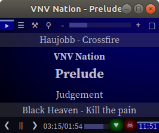

# mixplayd
This is the manager and player that can run headless and will just play the shuffled Music content.

This is destined to run on a headless box and supply the stereo with a constant stream of music, allowing remote controls over a dedicated web API.

### Features
* Music database to avoid scanning on every start
* Skipping titles forward/backward
* Jumping forward backward during play
* favourites
* do-not-play lists
* shuffle play that avoids the same artist twice in a row
* shuffle will play each title before shuffling again
* URL stream play
* playlist support
* MP3 tag suport with guessing mechanism on missing tags

### Planned
* native MP3 streaming to support HTTPS streams and avoid running extra mpg123 processes
* serve stream (unlikely but desireable)

### Parameters
* -d         : increase console verbosity. Tells mixplayd to not detach and run in debug mode (this reads web files from the filesystem and does not use the hard coded versions.)
* -f         : disable fading
* -F         : enable fading
* -h         : print help
* -p <port>  : set port for remote play [2347]
* -v         : increase application verbosity
* [path|URL] : path to the music files [play from db]
